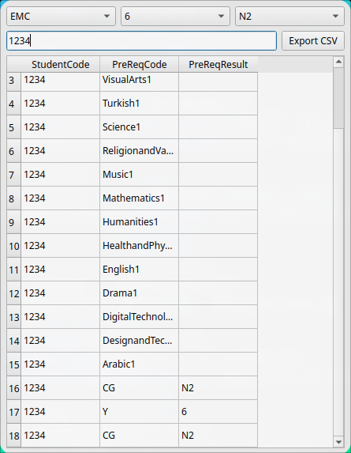

# SSO Student Data Generator

> [!NOTE]
> This must be used when adding a new student to Subject Selection Online

This program helps generate CSV files that can be uploaded to Subject Selection Online (SSO) for timetabling purposes. It provides a simple graphical interface to input student data and export it in the correct format.


## Installation


> [!NOTE]
> Sirius staff seeking guidance on `git` and `uv` should refer to the [internal documentation](https://docs.google.com/document/d/1R7YLiSa9H9-DQCdnC319mpJYSuuJIzYYbIoGzTuFBhg/edit?pli=1&tab=t.0) or speak to either IT or Ryan Greenup in B-G.2 for guidance

```sh
uv tool install git+https://github.com/RyanGreenup/sso_new_student_make_results
# Windows
~/.local/bin/sso_new_results
```

Then run it like so:

- Mac OSX and Linux
    ```sh
    ~/.local/bin/sso_new_results
    # Consider adding to the PATH with
    PATH="${PATH}:$HOME/.localbin/sso_new_results"

    ```
- Windows
    ```sh
    $env:USERPROFILE\.local\bin\sso_new_results
    # Consider adding to the `$PATH` with e.g.:
    $env:PATH = "C:`\Users`\Ryan.Greenup`\.local`\bin;$env:PATH"
    ```


## Getting Started

1. Launch the program by opening the terminal (Powershell on Windows) and running the program as described above.
2. The main window will open with several input fields:

   - Campus: Select from EMC, MFC, IDC, or KBC
   - Year Level: Choose from years 6-11
   - Entrance Score: Select from N2-N5
   - Student ID: Enter the student's identification number

   

3. The table will automatically update as you change these values

## Exporting Data

1. After entering the required information, click the "Export CSV" button
2. Choose where to save your CSV file
3. The generated file can be directly uploaded to SSO

## Tips

- The table updates automatically as you change any input field
- Make sure to check the data in the table before exporting
- The exported CSV will be formatted correctly for SSO upload
- You can export multiple times with different settings if needed

## Need Help?

If you encounter any issues or have questions, contact the IT helpdesk or Ryan Greenup in B-G.2 for guidance
